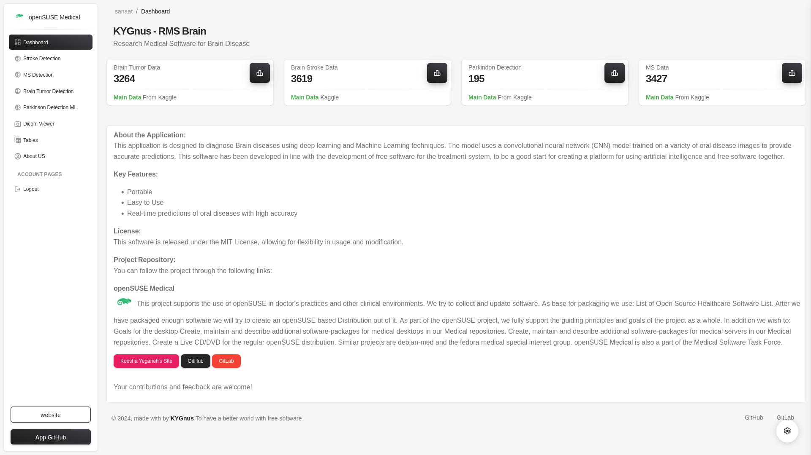

# rms-brain

This software is developed to diagnose brain diseases and it is the second part of RMS software.
This software is open source and portable and can be used on Linux, Mac and Windows.




## Features

- Brain Tumor Detection with Depplearning (Monai)
- alzheimer Detection with Depplearning (Monai)
- Brain Stroke Detection with Depplearning (Monai)
- Parkinson Detection with MachineLearning (Scikit-learn)


---


### Brain Tumor

In this section, using the monai library and relevant system data, a reasonable output for accurate tumor detection has been developed.

### Alzheimer Detection

In this section, using the monai library and relevant system data, a reasonable output has been developed for accurate diagnosis of Alzheimer's.

### Brain Stroke

In this section, using the monai library and relevant system data, a reasonable output for accurate stroke diagnosis has been developed.

### Parkinson

The provided dataset appears to be commonly used for Parkinson's disease detection and analysis in machine learning projects. Each row in the data represents a voice measurement from a patient, and the dataset includes various acoustic features extracted from sustained phonation of the vowel sound /a/. Here's a detailed explanation of the parameters:

### Description of Parameters:
1. **Name**: Identifier for the patient/voice recording.
2. **MDVP:Fo(Hz)**: Fundamental frequency (average pitch) in Hertz.
3. **MDVP:Fhi(Hz)**: Maximum vocal fundamental frequency in Hertz.
4. **MDVP:Flo(Hz)**: Minimum vocal fundamental frequency in Hertz.
5. **MDVP:Jitter(%)**: Variation in pitch (%).
6. **MDVP:Jitter(Abs)**: Absolute variation in pitch.
7. **MDVP:RAP**: Relative average perturbation (measure of pitch variation).
8. **MDVP:PPQ**: Five-point period perturbation quotient.
9. **Jitter:DDP**: Average absolute difference of differences between consecutive jitter cycles.
10. **MDVP:Shimmer**: Variation in amplitude.
11. **MDVP:Shimmer(dB)**: Amplitude variation in decibels.
12. **Shimmer:APQ3**: Three-point amplitude perturbation quotient.
13. **Shimmer:APQ5**: Five-point amplitude perturbation quotient.
14. **MDVP:APQ**: Average perturbation quotient.
15. **Shimmer:DDA**: Average absolute difference of differences between consecutive amplitude values.
16. **NHR**: Noise-to-harmonics ratio (measures breathiness or hoarseness in voice).
17. **HNR**: Harmonics-to-noise ratio (inverse of NHR, higher indicates clearer voice).
18. **Status**: Health status (1 = Parkinson's, 0 = healthy).
19. **RPDE**: Recurrence period density entropy (nonlinear dynamical complexity measure).
20. **DFA**: Detrended fluctuation analysis (correlation within the time series).
21. **Spread1**: Nonlinear measure related to the fundamental frequency.
22. **Spread2**: Nonlinear measure related to the fundamental frequency variation.
23. **D2**: Nonlinear dynamical complexity measure.
24. **PPE**: Pitch period entropy (a measure of voice irregularity).

**Commonly taken from sustained phonation of a vowel sound, such as "ahhh," to ensure a consistent and analyzable voice signal**


Acuuricy of trained Parkinson Data : 

```

Accuracy: 0.95

Classification Report:
              precision    recall  f1-score   support

           0       1.00      0.71      0.83         7
           1       0.94      1.00      0.97        32

    accuracy                           0.95        39
   macro avg       0.97      0.86      0.90        39
weighted avg       0.95      0.95      0.95        39


```

### Summary:
- The dataset focuses on acoustic analysis of speech to identify patterns indicative of Parkinson’s disease.
- Parameters like jitter, shimmer, NHR, and HNR are critical in analyzing voice stability and clarity, which are often affected in Parkinson's patients.
- Nonlinear dynamical measures like RPDE, DFA, Spread1/Spread2, and D2 capture complex, subtle patterns in voice signal variations.
- The **status** column is the target variable used in classification tasks (1 for Parkinson’s disease, 0 for healthy individuals).

### Applications:
This dataset is widely used in:
- **Machine Learning**: Building models to predict Parkinson's disease from voice measurements.
- **Signal Processing**: Understanding the effect of Parkinson’s disease on voice features.
- **Clinical Diagnosis**: Supporting non-invasive diagnostic methods for early detection.


---

https://www.kaggle.com/datasets/ninadaithal/imagesoasis
https://www.kaggle.com/datasets/vikasukani/parkinsons-disease-data-set
https://www.kaggle.com/datasets/buraktaci/multiple-sclerosis/data
